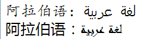

# 字体排版引擎底层Fallback处理机制介绍 #

## 1.什么是排版字体Fallback机制？ ##

文字排版引擎的Fallback机制其实是一种保护机制，为了在文本内容最终显示的时候，不会由于给定的字体（或字体列表）字形不全导致无法显示。

假设让浏览器排版这么一段文本： **“阿拉伯语：عربية‎ لغة”**。
这是一段包含中文和阿拉伯文的混合文本，我们分别指定两种字体让浏览器去渲染：

```
<p style="font-family:楷体">阿拉伯语：عربية‎ لغة</p>
<p style="font-family:andalus">阿拉伯语：عربية‎ لغة</p>
```

显示出来是这样：



首先我们知道楷体字体中并不包含阿拉伯文字的字形，同样Andalus字体中也没有中文文字的字形，但是无论我们指定使用哪种字体浏览器都能正确的显示出文字内容，区别只在于不同语言文字所使用的字体。

所以对于浏览器的排版引擎来说，虽然用户指定了一种字体，但是具体到文本中的每个字符最终使用何种字体排版还需要具体情况具体对待。如果遇到无法使用用户指定字体排版的字符就需要字体的Fallback机制了。

## 2.字体Fallback机制的技术实现 ##

知道了浏览器排版引擎的这种机制，那么技术上我们怎么实现呢？

字体Fallback技术就是： **如何判断指定的字体可以显示指定的文本内容，以及如何选择可以显示的替代字体**，其核心是判断 **字符（Character）和字体（Font）的包含关系**。因此其技术实现主要分为一下几个步骤：

0. **确定不同语言的fallback默认字体**。 字体列表会受到不同平台自带字体的差异影响。一般会针对Windows、MAC、Linux、Android、iOS有不同的fallback列表。
1. **读取字体cmap信息，建立字符映射表**， 字符映射表一般只在用到的时候生成一次，需要做缓存
2. **将输入文本切分成性质一致的TextRun**，主要根据书写方向（bidi）、语言（script）来切分，一般都会利用ICU库来辅助判断
3. **遍历TextRun中的每一个字符，根据字符映射表确定最终字体。**

### 字符映射表的建立和使用 ###

上述方案中最复杂的是字符映射表的建立和使用，目前比较通用的方案是采用类似SparseBitArray的位图表。这是由于Unicode标准会将相同语言的字符编码到同一个位面，也就是同一个编码区段，而字体文件一般也都是支持一种或多种语言，这就导致了字体文件的cmap也是一些离散的区段，所以使用稀疏位图来表示最好不过。

```
void SparseBitSet::initFromRanges(const uint32_t* ranges, size_t nRanges) {
    if (nRanges == 0) {
        mMaxVal = 0;
        mIndices.reset();
        mBitmaps.reset();
        return;
    }
    mMaxVal = ranges[nRanges * 2 - 1];
    size_t indexSize = (mMaxVal + kPageMask) >> kLogValuesPerPage;
    mIndices.reset(new uint32_t[indexSize]);
    uint32_t nPages = calcNumPages(ranges, nRanges);
    mBitmaps.reset(new element[nPages << (kLogValuesPerPage - kLogBitsPerEl)]);
    memset(mBitmaps.get(), 0, nPages << (kLogValuesPerPage - 3));
    mZeroPageIndex = noZeroPage;
    uint32_t nonzeroPageEnd = 0;
    uint32_t currentPage = 0;
    for (size_t i = 0; i < nRanges; i++) {
        uint32_t start = ranges[i * 2];
        uint32_t end = ranges[i * 2 + 1];
        // LOG_ALWAYS_FATAL_IF(end < start);  // make sure range size is nonnegative
        uint32_t startPage = start >> kLogValuesPerPage;
        uint32_t endPage = (end - 1) >> kLogValuesPerPage;
        if (startPage >= nonzeroPageEnd) {
            if (startPage > nonzeroPageEnd) {
                if (mZeroPageIndex == noZeroPage) {
                    mZeroPageIndex = (currentPage++) << (kLogValuesPerPage - kLogBitsPerEl);
                }
                for (uint32_t j = nonzeroPageEnd; j < startPage; j++) {
                    mIndices[j] = mZeroPageIndex;
                }
            }
            mIndices[startPage] = (currentPage++) << (kLogValuesPerPage - kLogBitsPerEl);
        }

        size_t index = ((currentPage - 1) << (kLogValuesPerPage - kLogBitsPerEl)) +
            ((start & kPageMask) >> kLogBitsPerEl);
        size_t nElements = (end - (start & ~kElMask) + kElMask) >> kLogBitsPerEl;
        if (nElements == 1) {
            mBitmaps[index] |= (kElAllOnes >> (start & kElMask)) &
                (kElAllOnes << ((~end + 1) & kElMask));
        } else {
            mBitmaps[index] |= kElAllOnes >> (start & kElMask);
            for (size_t j = 1; j < nElements - 1; j++) {
                mBitmaps[index + j] = kElAllOnes;
            }
            mBitmaps[index + nElements - 1] |= kElAllOnes << ((~end + 1) & kElMask);
        }
        for (size_t j = startPage + 1; j < endPage + 1; j++) {
            mIndices[j] = (currentPage++) << (kLogValuesPerPage - kLogBitsPerEl);
        }
        nonzeroPageEnd = endPage + 1;
    }
}
```
