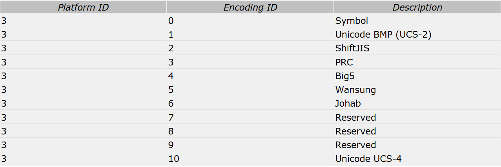

# 字体排版引擎底层Fallback处理机制介绍 #

## 1.什么是排版字体Fallback机制？ ##

文字排版引擎的Fallback机制其实是一种保护机制，为了在文本内容最终显示的时候，不会由于给定的字体（或字体列表）字形不全导致无法显示。

假设让浏览器排版这么一段文本： **“阿拉伯语：عربية‎ لغة”**。
这是一段包含中文和阿拉伯文的混合文本，我们分别指定两种字体让浏览器去渲染：

```
<p style="font-family:楷体">阿拉伯语：عربية‎ لغة</p>
<p style="font-family:andalus">阿拉伯语：عربية‎ لغة</p>
```

显示出来是这样：


首先我们知道楷体字体中并不包含阿拉伯文字的字形，同样Andalus字体中也没有中文文字的字形，但是无论我们指定使用哪种字体浏览器都能正确的显示出文字内容，区别只在于不同语言文字所使用的字体。

所以对于浏览器的排版引擎来说，虽然用户指定了一种字体，但是具体到文本中的每个字符最终使用何种字体排版还需要具体情况具体对待。如果遇到无法使用用户指定字体排版的字符就需要字体的Fallback机制了。

## 2.字体Fallback机制的技术实现 ##

知道了浏览器排版引擎的这种机制，那么技术上怎么实现呢？

字体Fallback技术就是： **如何判断指定的字体可以显示指定的文本内容，以及如何选择可以显示的替代字体**，其核心是判断 **字符（Character）和字体（Font）的包含关系**。这就需要利用字体文件（Font）中的**CMAP表**来查询是否包含要显示的字符。

### CMAP表 ###
**CMAP表** 是字体文件中用于定义**字符编码**到**字形（Glyph）ID**的映射表。所有字体支持的字符都可以通过这个表查询到相应的Glyph ID。而对于不支持的字符要么这个表查不到要么查到的Glyph ID会映射到0，也就是通常所说的（.nodef）。

首先CMAP表有一个表头:
>
